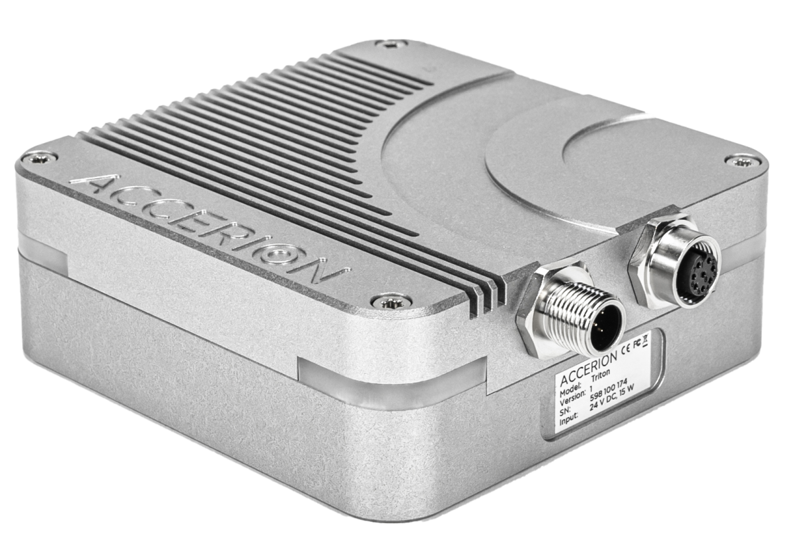
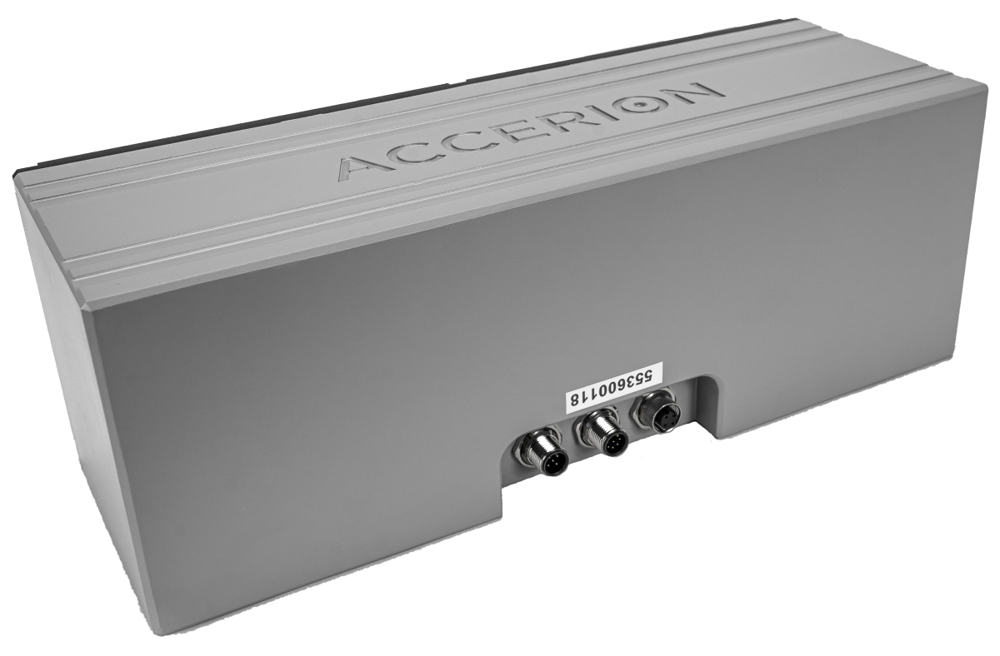
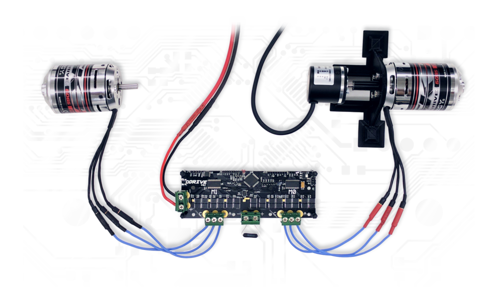
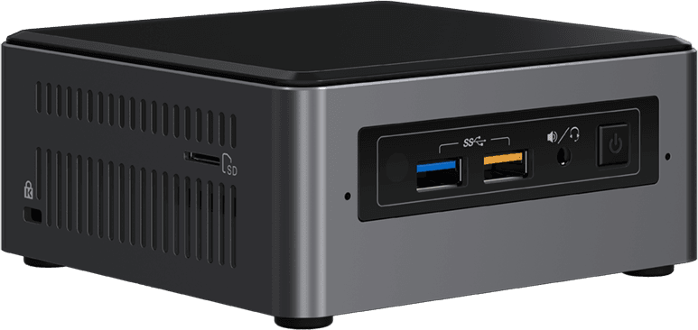
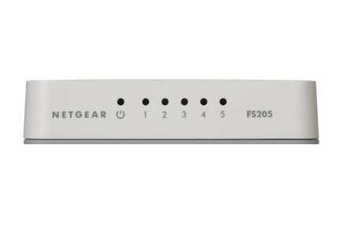

# 5. Hardware
In this section information about the hardware of the scout can be found.

## 5.1 Sensors
- The scout has 2 Tritons and 1 Jupyter.
- The Tritons make images from the surface from which features can be recognized. These features can be recognized by Robins. The Tritons are not able to localize their position in comparison to the origin. The Jupyter is responsible for absolute localization. This way the features recognized by the Tritons can be translated in to an absolute position.

**Figure 1** Triton

**Figure 2** Jupiter

## 5.2 Power supply

## 5.3 ODrive
The ODrive handles the communication with the encoder and motor of the wheels. 

**Figure 3** ODrive

## 5.4 NUC
The NUC is the computer in the scout on which all software is run. The NUC communicates with the ODrive, receives the data from the sensors and runs CX-Appcenter and its apps. 

**Figure 4** NUC

## 5.5 Switch
The switch connects the sensors with the NUC. This way the data from the sensors can be transferred to the NUC.

**Figure 5** Switch

## 5.6