# 5. Autonomated Mapping Tool (AMT)

Documentation on the AMT

## 5.1 Toolbar

## 5.2 Field Editor

## 5.3 Scout Panel

## 6.1 Installation
The GUI software is installed manually.

### 6.1.1 Install Docker
We heavily rely on docker for containarization. The latest version should be installed on the scout. Refers to https://docs.docker.com/engine/install/ubuntu/
- install using apt package manager
```
sudo apt-get update
sudo apt-get install docker-ce docker-ce-cli container.io
```

> in case apt does not find the packages update the apt repository. This is shown in link above.

- You should be able to run docker as user.
```
sudo groupadd docker
sudo usermod -aG docker $USER
```
- Log out and back in so that your group membership is re-evaluated.
```
newgrp docker
```
- Please verify that docker is installed correctly with
```
docker run hello-world
```
> In case this does not work, try: sudo apt install docker.io

### 6.1.2 Install GUI
- extract scout-gui.zip using file-explorer or terminal
```
pvadmin@<scout_ip>:/home/pvadmin/envs/cx-appcenter/apps/
```
- copy the service file
```
sudo cp /home/pvadmin/envs/cx-appcenter/apps/scout-gui/0.1-unstable/cx_scout-gui_0.1-unstable@.service  /etc/systemd/system/
```
- build the container
```
/home/pvadmin/envs/cx-appcenter/apps/scout-gui/0.1-unstable/cx-auto-mapping-service/./build.sh
```
- edit the ip address in the settings to the scout ip-address
```
nano /home/pvadmin/envs/cx-appcenter/apps/scout-gui/0.1-unstable/cx-auto-mapping-service/settings.env
```
- restart the daemon and start systemd service
```
sudo systemctl daemon-reload
sudo systemctl enable cx_scout-gui_0.1-unstable@1.service
sudo systemctl start cx_scout-gui_0.1-unstable@1.service
```
---
## 6.2 Usage

The two main functionalities of the GUI is **create & edit mapping plans** and **mapping control**.

## 6.2.1 Create a field

The Scout needs to know the coordinates of the field. The GUI will help you create a compatible field for the Scout.

- add a field:  find & click the **add field** button on top bar. This action will add a 10 * 10 field in the center of GUI.

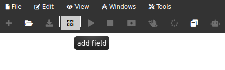
<center>Figure 6.1: Add a field </center>

- adjust the shape of field:
    - In the field editor, change the X-Y coordinates of the field corner to match the contour
    - By clicking the **Add +** button in **Contour Points** to add more points or clicking **trash** icon following the point to be removed.

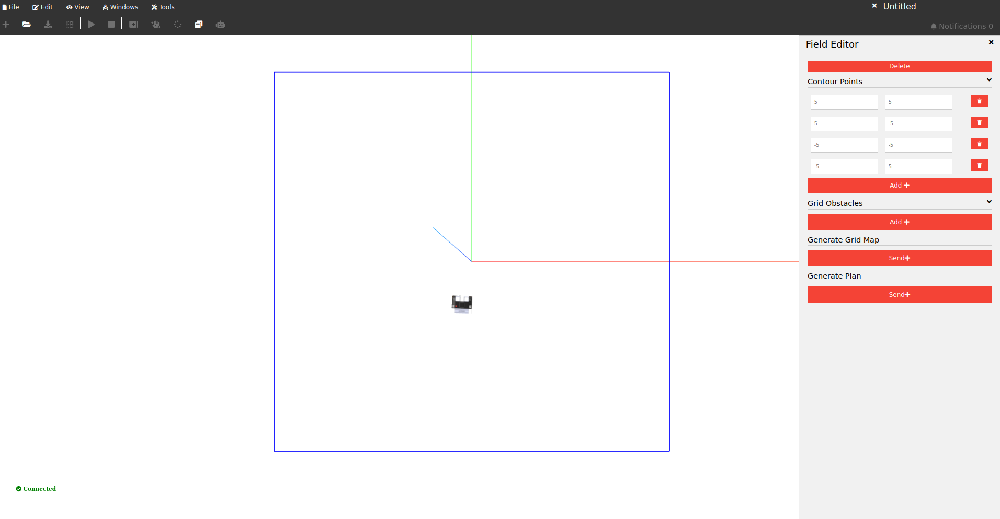
<center>Figure 6.2:  Edit a field</center>

- add/delete obstacles
    - obstacles can be added in the **Grid Obstacles** editor by clicking **Add+**.
    - To delete obstacles the **-** button can be clicked in the **Grid Obstacles** editor.
    - To add points the **+** button in the **Grid Obstacles** editor can be used.
    - To delete points use the **trash** icon next to the point in the **Grid Obstacles** editor.

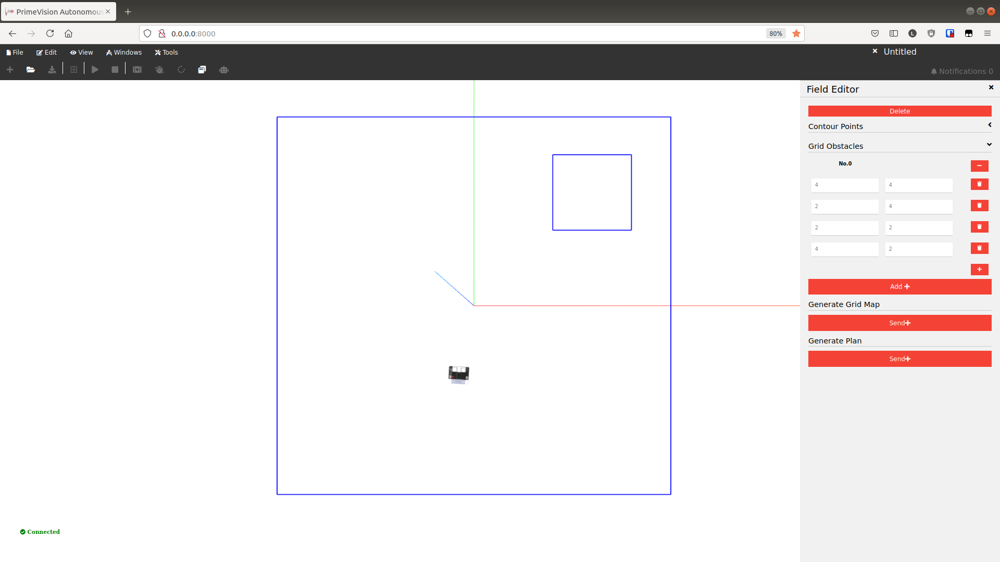
<center>Figure 6.3 Add obstacles </center>

## 6.2.2 Generating a grid map
The grid map defines the branches mapped by the scout. You can create a grid map yourself with the GUI or load a pre-compiled grid map.

- Generate the grid map
    - In the **Field editor** click **Send+** button under **Generate Grid Map**.

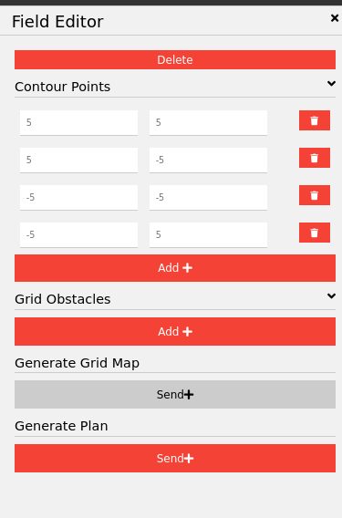
<center>Figure 6.4 Generate the grid map in field editor</center>

- Import pre-compiled grid map
    - A grid map can be loaded directly from a .JSON file through **Open** button in top toolbar.

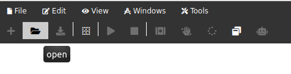
<center>Figure 6.5 Import a grid map from a JSON file</center>

## 6.2.3 Create a Mapping Plan

The mapping plan defines the path of the scout to the branches.

- You have created a grid map.
- click **Send+** button under **Generate Plan**
    - note: this only works if the grid map has been drawn

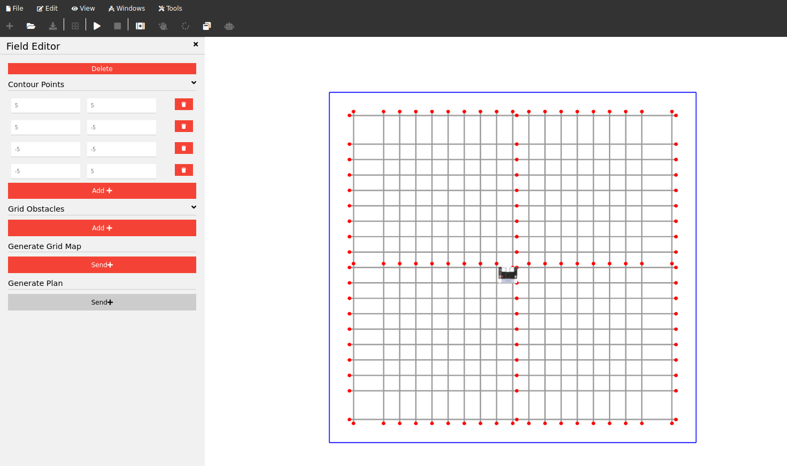
<center>Figure 6.6 Create a mapping plan in field editor</center>

## 6.2.4 Mapping Control
- Initiate the mapping system
- Start the mapping process
- Pause the mapping process
- Recover the mapping process
- Stop the mapping process
- Finalizing the mapping procedure

## 6.3 Feature Overview

All buttons and tabs with functionalities.

### 6.3.1 Toolbar
The toolbar allows for access to most of the functionalities provided by the scout/mapping tool; it can be seen in the figure below.

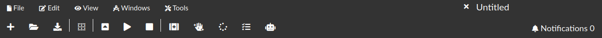
<center>Figure 6.7 Overview of the Toolbar</center>

### 6.3.2 Toolbar Tabs
The upper section of the toolbar is relatively self-descriptive, as a combination of text and icons is provided, and its set-up is mostly standardized. It consists of five tabs, which when hovered over show the respective drop-down menu for each tab; from the drop-down menu, different functionalities can be accessed by using the left-click button while hovering over the desired functionality.

The File tab with its associated drop-down can be seen in Figure 3. The New button allows the user to create a new map, while the Open File button is used to load an existing map file where the file can be selected from a file explorer which opens automatically. Lastly, the grid and route maps can be exported as files using the corresponding buttons.


<center>Figure 6.8 Overview of the File tab</center>

The Edit tab enables three basic but important functionalities when editing or creating a map: Undo, Redo, and Copy; these can be seen in Figure 4. The Undo functionality allows the user to return the map to the state it was in before the last action carried out by the user. The Redo button may only be used in combination with the Undo functionality, as it removes the last change made by the Undo button. Lastly the Copy button allows the user to copy the current selection.


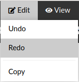
<center>Figure 6.9 Overview of the Edit tab</center>

The View tab is shown in Figure 5; there, the four functionalities which allow the user to modify the Field of View (FoV) can be clearly seen. Increment Fov zooms out the map fro the center of the image, while Decrement Fov does the opposite. Rotate Fov rotates the map 90 degrees clockwise about the vertical (blue) axis. Lastly, Reset Fov changes the view to the original view presented when starting up the tool; this original view is placed along the vertical (blue) axis thus becoming a two-dimensional representation of the map along the remaining two axes.

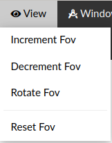
<center>Figure 6.10 Overview of the View tab</center>

The Windows tab is used to launch the different windows that enable additional context-based functionalities as can be seen in Figure 6. As of now, the only launchable window from this tab is the field editor, which allows the user to modify existing fields. This functionality will be discussed further in the Contextual menus section.


<center>Figure 6.11 Overview of the Window tab</center>

Lastly, the tools tab allows the user to launch new tools. The tab, together with its context menu can be seen in Figure 6.12

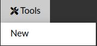
<center>Figure 6.13 Overview of the Tools tab</center>

### 6.3.3 Toolbar icons

Apart from the tabs, there is a number of icons which double as buttons. When left-clicked with the mouse, each icon triggers its corresponding action. The different icons that can be used are shown in Figure 8. The figure is overlayed with red numbers for reference purposes for this manual; however, when using the tool these numbers are not present. The icons are as follows: 1-add node, 2-open, 3-download grid map, 4-add field, 5-init, 6-play, 7-stop, 8-recovery mode, 9-manual control, 10-reset, 11-progress, and 12-push plan to robot.

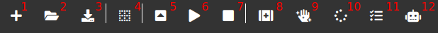
<center>Figure 6.14 Numbered icons</center>

1. The add node button, if pressed, will generate a new node at the origin. Further button presses will generate additional overlapping nodes at the same location.

2. The open button has the same functionality as the Open file button under the File tab; being used to load an existing map file, where the file can be selected from a file explorer which opens automatically.

3. Download grid map also has the same functionality as the Export Grid Map button under the File tab; when pressed a file explorer menu is opened, which allows the user to choose the location and name of the offline copy of the grid map currently being edited.

4. The field editor button is used to both generate 

5. INIT

6. The play button can be used to start the system; when pressed, a menu pops up which demands confirmation on whether the system should start.

7. The stop button is used to stop the system when operating. Similarly to the play button, a confirmation menu opens up when the stop button is pressed.

8. Recovery mode

9. Manual control allows the user to take over control of the scout unit; it also comes with a confirmation menu pop-up after the initial button press.

10. The reset button can be pressed in order to reset the mapping process of the scout. The aforementioned confirmation pop-up is also activated after the button press. 

11. Progress

12. push plan to robot

### 6.3.4 Additional options

Separate from the previously described tabs and buttons, there are two additional functionalities within the upper section of the tool: file name editing and notifications as can be seen in Figure 9. The default name for the map is "Untitled"; this text can be selected, and can be modified by simply typing a new name into the section. Additionally, the number of unseen notifications can be seen displayed next to the "Notifications text". If this button is pressed, the notifications menu will pop-up on the right side of the window as shown in Figure 10 where all notifications can be seen. This menu can be refreshed in order to show the latest notifications by pressing the "Refresh" button.

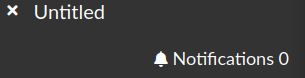
<center>Figure 6.15  Remaining functionalities</center>

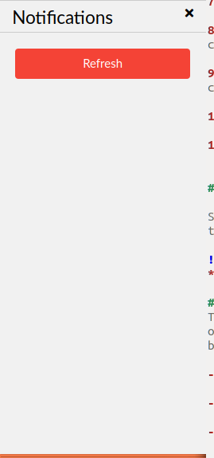
<center>Figure 6.16 Notifications window</center>

### 6.3.5 Map
The map allows for three-dimensional visualization of the operational environment of the scout tool. The operator is able to customize the view camera of the environment. Three different axes can be seen, with the blue axis showing the vertical axis and the red and green axes representing longitudinal and lateral axes respectively.

To pan the view, use 2 fingers on touchscreens or hold and drag with right-click on your mouse. 1 finger or left-click hold and drag will rotate the view. Lastly, the view can be zoomed-in or -out by pinching two fingers together or scrolling with the mouse wheel.

### 6.3.6 Contextual menus
Lastly there are a number of contextual menus that can be interacted with; these are, namely, the field and node editor menus. 

The node editor menu can only be accessed after adding a node. Once a node has been added to the map, the node editor menu can be launched by right-clicking while hovering over the node where it will pop-up on the side of the window as shown in Figure 11. Via this menu, detailed node definition operations can be carried out. The position of the node can be set with the longitudinal, lateral, and vertical coordinates in order under the Settings section. The Events section can be used to assign one or several events that are triggered at the node. These can be both "START MAPPING" and "STOP MAPPING" which will instruct the scout on where the mapping process must start and stop. Additionally, conditions can be set for the node, such as "POSE X", "POSE Y", "POSE HEADING", and "ALIGN CLUSTER" which control the orientation of the node.


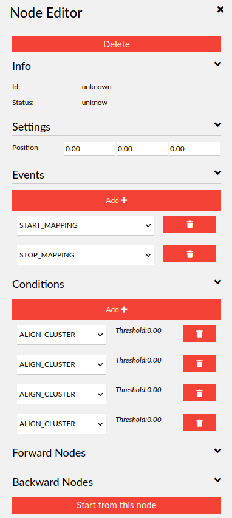
<center>Figure 6.17  Node editor menu</center>
The field editor menu can be seen in Figure 12. It is launched via the corresponding button in the icons toolbar or under the Windows tab. The field is the area where the scout will operate, with its perimeter defined by a user-defined number of coordinates under the Contour points section. Additionally, a variable number of obstacles can also be generated in the Grid obstacles section which uses the same process to define its perimeter. It is important to note that the connections for both the field and obstacles between the given coordinates are in clockwise order when reading from the top of the list. The Generate grid map and plan buttons are equivalent to those under the File tab as described previously.

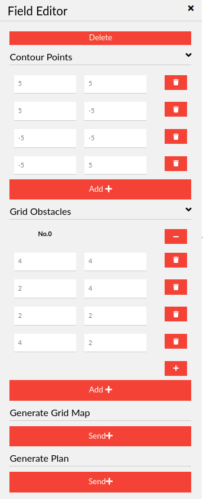
<center>Figure 6.18 Field editor menu</center>

The "Add +" button can be used in any section to add an instance such as coordinate or event, while the trashcan icon can be used to remove any individual instances. Furthermore, the Delete button in the header of the menu can be used to delete the node together with all its parameters. Once the editing of the node or field is completed, the menu can simply be closed using the upper-right corner cross icon where, if pressed, the settings will be saved. For the readers benefit and for reference, a simple sample map was generated with nodes, field and an obstacle.

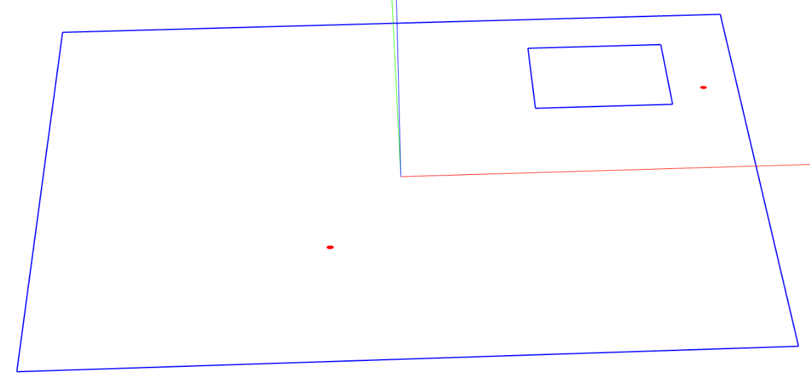
<center>Figure 6.19 Sample map with nodes (red), field (outer blue area), and obstacle (inner blue area)</center>